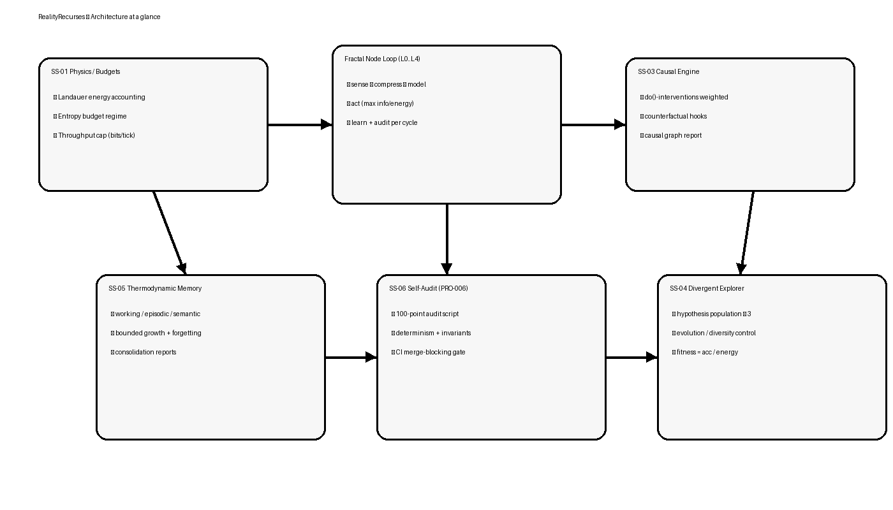
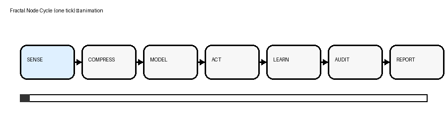

# RealityRecurses

[](https://github.com/OWNER/REPO/actions/workflows/pr-quality.yml)


RealityRecurses is a **physically bounded, causal agent architecture** designed to make claims **falsifiable, reproducible, and audit-gated**:
- **Energy accounting** (Landauer-style bookkeeping) ✅
- **Finite information regimes** (entropy saturation → regime transition) ✅
- **Causal learning** where **interventions outweigh observations** ✅
- **Bounded memory** with controlled consolidation/forgetting ✅
- **Self-audit** producing merge-blocking reports ✅

> The repository is opinionated: if invariants fail, **PRs should not merge**. 🧪🧱

---

## Visual summary (what this repo actually is)

### Architecture at a glance


### Fractal node cycle (animated)


### Control loop (Mermaid)
```mermaid
flowchart LR
  A[Environment.observe()] --> B[Fractal pipeline\n sense→compress→model]
  B --> C[Action select\n max info gain / energy]
  C --> D[Environment.step(action)]
  D --> E[Causal update\n observational + interventional]
  D --> F[Memory store\n working/episodic/semantic]
  E --> G[Self-audit\n invariants + reports]
  F --> G
  G --> A
```

---

## Quickstart

```bash
python -m pip install -e .[dev]
pytest -q
python scripts/audit.py
python scripts/benchmarks.py --quick --out benchmarks.json
python scripts/pr_gate.py --quick
```

---

## PR quality gates (merge-blocking)

**Single entrypoint** (local or CI):
```bash
python scripts/pr_gate.py --quick
python scripts/pr_gate.py --full
```

**What is enforced:**
- ruff lint
- black format check
- mypy type check
- pytest suite (excluding `validation` by default)
- coverage gate **>= 90%**
- benchmarks JSON contract
- audit (100-point)

Documentation: `docs/PR_QUALITY_GATES.md`

---

## Repository map (where to look)

- `src/reality_recurses/` — core agent + toy env + audit-facing API
- `src/reality_scaler/` — implementation modules (physics, memory, causal, fractal, divergent)
- `scripts/audit.py` — 100-point audit (CI gate)
- `scripts/benchmarks.py` — contract benchmark output for PR gating
- `scripts/pr_gate.py` — unified PR gate runner
- `tests/` — unit/integration/regression + validation markers
- `docs/` — diagrams + gate policy

---

## Invariants (operational truth)

The system is built around **hard invariants**. Examples:
- energy consumed ≤ energy budget
- entropy consumed ≤ entropy total (regime switches when saturated)
- hypothesis population size ≥ 3 (diversity floor)
- audit must report and must not be suppressible

The canonical audit implementation is `scripts/audit.py`.

---

## License (non-commercial, no modified redistribution)

This repository is licensed under **CC BY-NC-ND 4.0**.

You may **read, run, and share unmodified copies** for research, study, and personal use.

You may **not**:
- use it for commercial purposes (selling, paid services, SaaS, consulting, courses, embedding in commercial products),
- redistribute modified versions,
- relicense or remove attribution.

See `LICENSE` for details.
